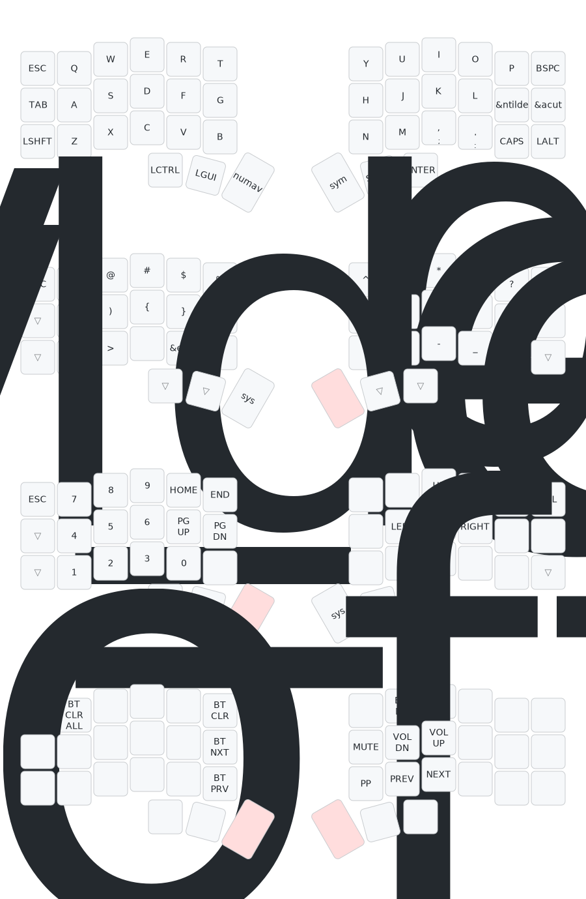

# Keymap — Corne TP

Layout diseñado para **macOS**, programación en **Kotlin/TypeScript/Angular** (IntelliJ + WebStorm), escritura frecuente en **español**, y uso del **trackpad integrado** en la mitad derecha.

**Sin hold-tap.** Todas las teclas hacen una sola cosa.

## Requisito previo en macOS

Configurar el input source a **"U.S."** o **"ABC Extended"** en System Settings → Keyboard → Input Sources. Esto permite usar los acentos españoles con Option+key (ver sección de acentos más abajo).

---

## Visualización completa

> Este SVG se genera automáticamente con [keymap-drawer](https://github.com/caksoylar/keymap-drawer) cada vez que cambia el keymap. No editar manualmente.



---

## Layer 0 — BASE

Letras QWERTY, puntuación básica, modificadores dedicados.

### Por qué cada tecla está donde está

- **LGUI (Cmd)** en pulgar izquierdo central → posición más cómoda para el modificador más usado en macOS (Cmd+C, Cmd+V, Cmd+S, Cmd+Z, Cmd+Tab…). Se combina fácilmente con cualquier letra de la mano izquierda.
- **LALT (Option)** en pos 34 (anular derecho, fila inferior) → para acentos españoles. Al estar en la mano derecha, permite combinar con las vocales de la mano izquierda (Option+E → vocal) sin contorsiones.
- **LCTRL** en pos 24 (esquina inferior izquierda, estilo Unix) → para atajos de IDE como Ctrl+Space (autocompletado en IntelliJ/WebStorm) y atajos de terminal.
- **RCLK** en pulgar izquierdo externo → clic derecho (menú contextual) con la mano izquierda mientras la mano derecha está en el trackpad. El clic izquierdo se hace tocando el propio trackpad (hardware).
- **ESC** no está en la capa base → se accede desde SYM o NUMAV. Para uso con IDEs (no Vim) es suficiente.

---

## Layer 1 — SYM

Símbolos de programación. Se activa manteniendo **MO(1)** (pulgar izquierdo interno).

### Organización

- **Home row izquierda**: `( ) { }` — los pares más usados en Kotlin/TS (llamadas a funciones, bloques, lambdas, objetos).
- **Home row derecha**: `[ ] < >` — arrays, genéricos, tags Angular/HTML.
- **Pares adyacentes**: cada par de apertura/cierre está al lado del otro para facilitar la memoria muscular.
- **Fila superior**: símbolos de Shift+número (familiar del teclado US), más `-` y `+`.
- **Fila inferior**: `\ | / ? :` a la izquierda, `; " ¿ ¡` a la derecha.
- **`¿` y `¡`**: macros ZMK que envían Option+Shift+/ y Option+1 automáticamente.
- **`___`** = transparente → LSHIFT, LALT y RSHIFT de la capa base siguen accesibles.

### Acceso a SYS desde SYM

Manteniendo MO(1) + pulsando MO(3) (pulgar derecho interno) → activa la capa SYS.

---

## Layer 2 — NUMAV (Números + Navegación)

Se activa manteniendo **MO(2)** (pulgar derecho interno).

### Organización

**Mano izquierda — numpad:**
- **Fila 1**: 7 8 9 (cols 1-3) + HOME / END (cols 4-5)
- **Fila 2**: 4 5 6 (cols 1-3) + PG_UP / PG_DN (cols 4-5)
- **Fila 3**: 0 1 2 3 (cols 0-3) — el 0 ocupa la esquina del meñique

**Mano derecha — flechas T-invertida (estilo gamer):**
```
   ↑
← ↓ →
```
- ↑ en fila 1 col 1, alineado sobre ↓ en fila 2 col 1
- ← ↓ → en fila 2 cols 0-2

**Combinable con modificadores** (transparentes desde base):
- Cmd+← = inicio de línea
- Cmd+→ = fin de línea
- Option+← = saltar palabra
- Shift+↓ = seleccionar línea
- Cmd+Shift+→ = seleccionar hasta fin de línea

### Acceso a SYS desde NUMAV

Manteniendo MO(2) + pulsando MO(3) (pulgar izquierdo interno) → activa la capa SYS.

---

## Layer 3 — SYS (Bluetooth, multimedia, brillo)

Se accede desde SYM o NUMAV manteniendo **MO(3)**.

### Funciones

- **BT 0–4**: selección de perfil Bluetooth (hasta 5 dispositivos).
- **BT_CLR**: borrar emparejamiento del perfil activo.
- **OUT_TOG**: alternar salida USB/Bluetooth.
- **SOFT_OFF**: entrar en deep sleep (ahorro de batería).
- **Brillo**: BRI_DN / BRI_UP (control de brillo de pantalla en macOS).
- **Volumen**: VOL_DN / VOL_UP / MUTE.
- **Multimedia**: PREV / PLAY (play/pause) / NEXT.

---

## Acentos en español

Con macOS configurado en layout **"U.S."** o **"ABC Extended"**:

| Carácter | Cómo teclearlo |
|----------|---------------|
| á é í ó ú | Mantén **LALT** (pos 34) + pulsa **E** → suelta ambas → pulsa la **vocal** |
| ñ | Mantén **LALT** + pulsa **N** → suelta ambas → pulsa **N** |
| ¿ | Mantén **MO(1)** → pulsa la tecla **¿** (pos 32 en SYM, macro automática) |
| ¡ | Mantén **MO(1)** → pulsa la tecla **¡** (pos 33 en SYM, macro automática) |

---

## Cómo acceder a la capa SYS

La capa SYS no se accede directamente desde BASE. Hay dos caminos:

1. **Desde SYM**: mantén MO(1) (pulgar izq interno) → pulsa MO(3) (pulgar der interno).
2. **Desde NUMAV**: mantén MO(2) (pulgar der interno) → pulsa MO(3) (pulgar izq interno).

En ambos casos se necesitan dos pulgares: uno mantiene la capa intermedia y el otro activa SYS. Al soltar cualquiera, vuelves a la capa anterior o a BASE.

---

## Resumen de pulgares

```
Pulgar izq externo (36):  RCLK      — clic derecho para trackpad
Pulgar izq central (37):  LGUI      — Cmd (el modificador más usado en macOS)
Pulgar izq interno (38):  MO(1)     — activa SYM mientras se mantiene
Pulgar der interno (39):  MO(2)     — activa NUMAV mientras se mantiene
Pulgar der central (40):  SPACE     — espacio
Pulgar der externo (41):  RETURN    — enter
```